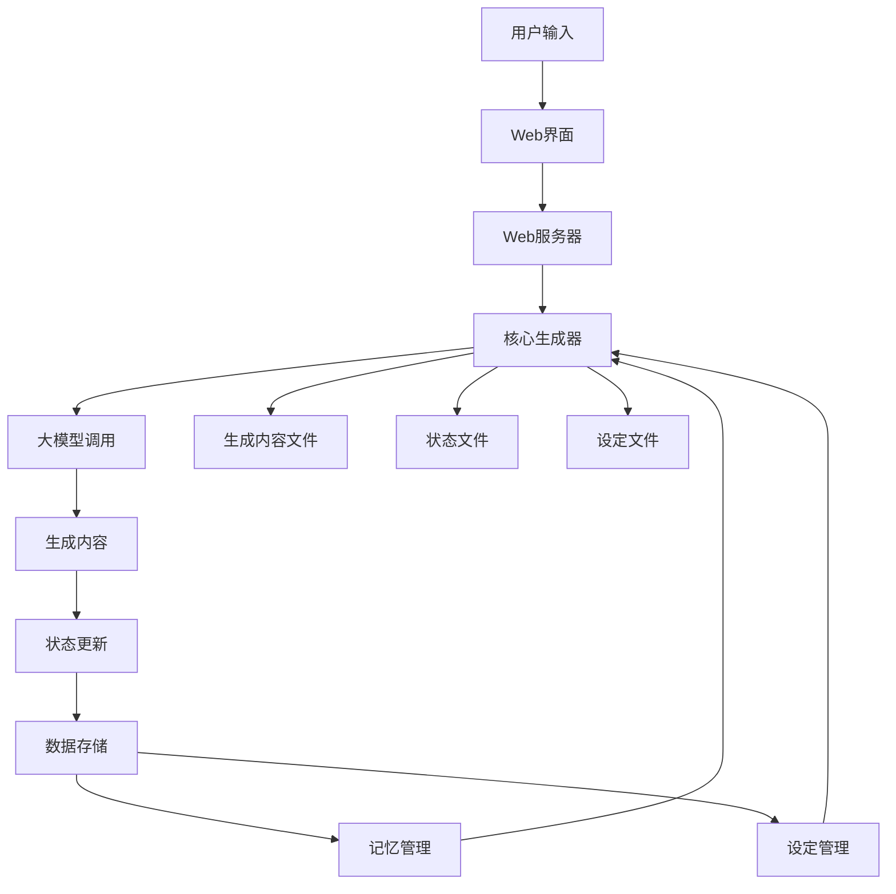

# AI小说生成系统技术文档

## 1. 项目概述

AI小说生成系统是一个基于LangChain框架构建的智能小说创作工具，支持多种大语言模型（如DeepSeek、OpenAI、Claude、Gemini等），具备状态管理和Web界面，旨在为用户提供便捷、高效的AI辅助小说创作体验。

### 1.1 核心功能

- **多模型支持**：系统集成了多种主流大语言模型，用户可根据需求选择合适的模型进行小说生成。
- **状态管理**：系统能够自动跟踪和管理小说创作过程中的角色状态、物品信息、人际关系等关键数据，确保故事的连贯性。
- **Web界面**：提供直观易用的Web界面，方便用户进行交互式创作和管理。
- **多项目管理**：支持创建和管理多个独立的小说项目，实现项目间数据隔离。
- **版本控制**：支持生成内容的多版本保存和比较，便于用户选择最优方案。

### 1.2 技术架构

系统采用模块化设计和分层架构，主要包括以下核心组件：

- **核心生成器 (main.py)**：负责小说内容的生成、状态更新和会话管理。
- **Web服务器 (web_server.py)**：提供Web界面和API接口。
- **功能模块 (modules/)**：包含大模型调用、记忆管理、设定管理等功能模块。
- **Web界面 (web/)**：前端界面，提供用户交互。
- **数据存储 (data/)**：存储小说状态、世界设定等数据。
- **生成内容 (xiaoshuo/)**：存储生成的小说章节内容。
- **提示词模板 (prompts/)**：存储系统核心提示词。
- **写作模板 (templates/)**：存储写作要求模板。

## 2. 模块功能说明

### 2.1 核心生成器 (main.py)

核心生成器是系统的核心模块，负责小说内容的生成、状态管理和记忆管理。

#### 2.1.1 NovelGenerator类

`NovelGenerator`类是核心生成器的主要类，提供了以下关键方法：

- `__init__(self, model_name="deepseek_chat")`：初始化生成器，设置默认模型。
- `generate_chapter(self, chapter_outline, model_name=None, novel_id="default", use_state=True, update_state=True)`：根据章节大纲生成小说内容，并可选择是否使用和更新状态。
- `chat(self, user_input, session_id, model_name=None)`：提供交互式会话功能。
- `update_state(self, chapter_content, current_state, novel_id="default")`：根据章节内容更新角色状态。
- `load_memory_by_range(self, novel_id, start_index, end_index)`：加载指定范围的记忆。
- `batch_compress_memory(self, novel_id, start_index, end_index)`：批量压缩记忆。
- `get_memory_stats(self, novel_id)`：获取记忆统计信息。
- `load_previous_chapters(self, novel_id, current_index)`：加载前面章节内容。

#### 2.1.3 状态管理

通过`StateManager`类管理小说创作过程中的状态信息，包括角色信息、物品清单、人物关系和剧情总结等。状态信息以JSON格式存储在`data/`目录下。

#### 2.1.4 记忆管理

系统通过`MemoryManager`类管理对话历史，支持分片存储和压缩，以应对长对话历史带来的上下文长度限制问题。

### 2.2 Web服务器 (web_server.py)

Web服务器基于Flask框架开发，提供RESTful API接口，对接前端界面。

#### 2.2.1 主要API端点

- `GET /`：返回Web界面。
- `GET /api/templates`：获取模板列表。
- `POST /api/templates`：保存模板。
- `GET /api/templates/<template_id>`：获取指定模板文件内容。
- `POST /generate`：生成小说章节。
- `GET /api/novels`：获取所有小说列表。
- `GET /api/novels/<novel_id>/states`：获取指定小说状态文件列表。
- `GET /api/novels/<novel_id>/latest-state`：获取指定小说最新状态。
- `POST /api/save-result`：保存生成结果。
- `GET /api/novels/<novel_id>/info`：获取指定小说完整信息。
- `POST /api/save-chapter`：保存章节。
- `POST /api/update-state`：手动更新角色设定。
- `GET /api/settings/<novel_id>`：获取设定文件列表。
- `GET /api/settings/<novel_id>/character/<version>`：获取指定版本人物设定。
- `GET /api/settings/<novel_id>/world/<version>`：获取指定版本世界设定。
- `PUT /api/settings/<novel_id>/character/<version>`：保存人物设定。
- `PUT /api/settings/<novel_id>/world/<version>`：保存世界设定。
- `POST /api/settings/<novel_id>/character/new`：创建新人物设定版本。
- `POST /api/settings/<novel_id>/world/new`：创建新世界设定版本。

### 2.3 功能模块 (modules/)

功能模块包含系统的核心功能实现。

#### 2.3.1 大模型调用 (llm_module.py)

负责调用各种大语言模型，提供统一的接口。

#### 2.3.2 状态管理模块

`StateManager`类负责管理小说状态文件，包括加载、保存和列出状态文件。

#### 2.3.3 记忆管理模块

`MemoryManager`类负责管理对话历史，支持分片存储和压缩。

#### 2.3.4 模板管理模块

模板管理模块负责管理写作模板，包括模板的创建、保存和加载。

### 2.4 Web界面

Web界面基于现代前端技术开发，提供直观易用的操作界面，用户可以通过Web界面进行小说生成、状态管理、模板管理和设定管理等操作。

## 3. API接口文档

### 3.1 生成章节

- **URL**: `/generate`
- **Method**: `POST`
- **Request Body**:
  ```json
  {
    "template_id": "模板ID",
    "chapter_outline": "章节细纲",
    "model_name": "模型名称",
    "use_state": true,
    "use_world_bible": true,
    "update_state": true,
    "session_id": "会话ID",
    "novel_id": "小说ID"
  }
  ```
- **Response**:
  ```json
  {
    "content": "生成的小说内容",
    "template_used": "使用的模板名称",
    "novel_id": "小说ID",
    "word_count": "字数",
    "generated_at": "生成时间"
  }
  ```

### 3.2 交互调用

- **URL**: 此端点不存在，请使用命令行chat()方法
- **Method**: `POST`
- **Request Body**:
  ```json
  {
    "message": "用户输入",
    "model_name": "模型名称",
    "session_id": "会话ID"
  }
  ```
- **Response**:
  ```json
  {
    "response": "AI回复",
    "session_id": "会话ID"
  }
  ```

### 3.3 状态更新

- **URL**: `/api/update-state`
- **Method**: `POST`
- **Request Body**:
  ```json
  {
    "novel_id": "小说ID",
    "chapter_index": "章节索引",
    "model_name": "模型名称"
  }
  ```
- **Response**:
  ```json
  {
    "message": "更新成功"
  }
  ```

### 3.4 模板管理

#### 获取模板列表

- **URL**: `/api/templates`
- **Method**: `GET`
- **Response**:
  ```json
  {
    "templates": ["模板列表"]
  }
  ```

#### 保存模板

- **URL**: `/api/templates`
- **Method**: `POST`
- **Request Body**:
  ```json
  {
    "id": "模板ID",
    "name": "模板名称",
    "files": {"文件类型": "文件名"},
    "contents": {"文件类型": "文件内容"}
  }
  ```
- **Response**:
  ```json
  {
    "message": "保存成功",
    "template_id": "模板ID"
  }
  ```

### 3.5 设定管理

#### 获取小说信息

- **URL**: `/api/novels/<novel_id>/info`
- **Method**: `GET`
- **Response**:
  ```json
  {
    "id": "小说ID",
    "name": "小说名称",
    "latest_chapter": "最新章节",
    "latest_state": { /* 最新状态JSON */ },
    "memory_stats": { /* 记忆统计信息 */ },
    "world_setting": { /* 世界设定JSON */ },
    "character_setting": { /* 角色设定JSON */ }
  }
  ```

### 3.6 设定管理接口

#### 获取设定文件列表

- **URL**: `/api/settings/<novel_id>`
- **Method**: `GET`
- **Response**:
  ```json
  {
    "character_versions": ["版本号列表"],
    "world_versions": ["版本号列表"]
  }
  ```

#### 获取人物设定

- **URL**: `/api/settings/<novel_id>/character/<version>`
- **Method**: `GET`
- **Response**:
  ```json
  {
    /* 人物设定JSON */
  }
  ```

#### 获取世界设定

- **URL**: `/api/settings/<novel_id>/world/<version>`
- **Method**: `GET`
- **Response**:
  ```json
  {
    /* 世界设定JSON */
  }
  ```

#### 保存人物设定

- **URL**: `/api/settings/<novel_id>/character/<version>`
- **Method**: `PUT`
- **Request Body**:
  ```json
  {
    /* 人物设定JSON */
  }
  ```
- **Response**:
  ```json
  {
    "message": "保存成功"
  }
  ```

#### 保存世界设定

- **URL**: `/api/settings/<novel_id>/world/<version>`
- **Method**: `PUT`
- **Request Body**:
  ```json
  {
    /* 世界设定JSON */
  }
  ```
- **Response**:
  ```json
  {
    "message": "保存成功"
  }
  ```

#### 创建新人物设定版本

- **URL**: `/api/settings/<novel_id>/character/new`
- **Method**: `POST`
- **Response**:
  ```json
  {
    "version": "新版本号"
  }
  ```

#### 创建新世界设定版本

- **URL**: `/api/settings/<novel_id>/world/new`
- **Method**: `POST`
- **Response**:
  ```json
  {
    "version": "新版本号"
  }
  ```

## 4. 数据流图



## 5. 部署和使用指南

### 5.1 环境准备

确保系统已安装Python 3.12或更高版本（项目要求）。

### 5.2 安装依赖

推荐使用uv工具链来安装依赖，这样可以获得更快的依赖解析和安装速度：

```bash
# 使用uv初始化项目（如果尚未初始化）
uv init

# 同步所有依赖到当前环境
uv sync
```

### 5.3 配置API密钥

编辑 `.env` 文件，配置所需模型的API密钥：

```env
# 至少配置一个模型的API密钥
DEEPSEEK_API_KEY=your_deepseek_api_key
OPENAI_API_KEY=your_openai_api_key
ANTHROPIC_API_KEY=your_anthropic_api_key
GOOGLE_API_KEY=your_google_api_key
DSF_API_MODEL="第三方api模型"
DSF_API_KEY="第三方api秘钥"
DSF_API_URL="第三方api链接"
```

### 5.4 启动服务

**Web界面（推荐）：**
```bash
python start_web.py
```
访问 `http://127.0.0.1:5001`

**命令行使用：**
```python
from main import NovelGenerator
generator = NovelGenerator()
content = generator.generate_chapter(
    chapter_outline="第一章：开始的故事",
    model_name="deepseek_chat",
    novel_id="my_novel"
)
```

### 5.5 使用说明

1. 通过Web界面访问系统。
2. 在模板管理中创建或选择合适的写作模板。
3. 在设定管理中创建或编辑小说的世界设定和角色设定。
4. 在批量生成中设置章节大纲并开始生成。
5. 系统将自动生成章节内容并更新角色状态。
6. 可通过手动更新角色设定功能调整角色状态。
7. 生成的内容将保存在 `xiaoshuo/` 目录下，状态和设定将保存在 `data/` 目录下。

## 6. 代码分析与改进建议

### 6.1 设计模式与架构思想

系统采用了模块化设计和分层架构，将功能划分为不同的模块，便于维护和扩展。同时使用了状态管理模式来管理小说创作过程中的状态信息。

### 6.2 优点

- **模块化设计**：代码结构清晰，易于维护和扩展。
- **多模型支持**：支持多种大语言模型，提高了系统的灵活性。
- **状态管理**：通过状态管理机制确保故事的连贯性。
- **Web界面**：提供直观易用的Web界面，提升用户体验。

### 6.3 改进建议

- **性能优化**：对于大规模小说生成任务，可以考虑引入异步处理机制以提高性能。
- **错误处理**：增强错误处理机制，提供更详细的错误信息和恢复策略。
- **安全性**：加强API接口的安全性，防止未授权访问。
- **可扩展性**：进一步优化模块设计，提高系统的可扩展性。

## 7. 原理解释与技术背景说明

### 7.1 关键命令执行原理

#### 7.1.1 小说生成命令 (`generate_chapter`)

**执行原理：**
1. **构建提示词**：系统首先根据用户提供的章节细纲、写手角色设定和写作规则构建一个完整的提示词。
2. **加载状态和设定**：如果启用了状态和世界设定，系统会加载最新的角色状态和世界设定，并将其附加到提示词中。
3. **调用大语言模型**：将构建好的提示词发送给指定的大语言模型进行内容生成。
4. **保存生成内容**：将生成的小说内容保存到`xiaoshuo/`目录下的相应文件中。
5. **更新状态**：如果启用了状态更新，系统会调用`update_state`方法，根据新生成的章节内容更新角色状态。

**参数说明：**
- `chapter_outline`：章节细纲，描述本章的主要情节和内容（可以是JSON字符串或纯文本）。
- `model_name`：指定使用的大语言模型名称。
- `system_prompt`：系统提示词，包含写手角色和写作规则（需要手动读取模板文件并拼接）。
- `session_id`：会话ID，用于区分不同的对话会话。
- `use_state`：是否使用角色状态。
- `use_world_bible`：是否使用世界设定。
- `update_state`：是否在生成后自动更新角色状态。
- `update_model_name`：用于状态更新的模型名称。
- `novel_id`：小说ID，用于区分不同的小说项目。
- `use_previous_chapters`：是否参考前面章节的内容。
- `previous_chapters_count`：参考前面章节的数量。

**流程分解：**
1. **输入处理**：接收用户输入的章节细纲和其他参数。
2. **提示词构建**：根据输入参数构建包含章节细纲、角色设定、世界设定的完整提示词。
3. **模型调用**：通过`LLMCaller`类调用指定的大语言模型。
4. **内容生成**：等待模型返回生成的小说内容。
5. **内容保存**：将生成内容保存到文件。
6. **状态更新**：如果启用，调用`update_state`方法更新角色状态。

**最佳实践：**
- **细纲编写**：章节细纲应尽可能详细，包含关键情节、人物互动和冲突点，以引导模型生成更符合预期的内容。
- **模型选择**：根据生成内容的风格和质量要求选择合适的模型。例如，DeepSeek适合生成中文网络小说，OpenAI适合生成更通用的内容。
- **状态管理**：定期检查和更新角色状态，确保故事的连贯性。

#### 7.1.2 状态更新命令 (`update_state`)

**执行原理：**
1. **构建提示词**：系统构建一个专门用于状态更新的提示词，包含旧的状态JSON和新生成的章节内容。
2. **调用大语言模型**：将提示词发送给指定的大语言模型，要求其分析章节内容并更新状态。
3. **解析模型输出**：系统解析模型返回的JSON格式状态信息。
4. **保存新状态**：将更新后的状态保存到`data/`目录下的状态文件中。

**参数说明：**
- `chapter_content`：新生成的章节内容。
- `current_state`：当前的角色状态对象。
- `model_name`：用于状态更新的模型名称。
- `novel_id`：小说ID。
- `system_prompt`：状态更新的系统提示词。

**流程分解：**
1. **输入处理**：接收章节内容和当前状态。
2. **提示词构建**：构建包含旧状态和新内容的提示词。
3. **模型调用**：调用模型进行状态分析。
4. **状态解析**：解析模型返回的JSON状态。
5. **状态保存**：将新状态保存到文件。

**最佳实践：**
- **模型选择**：状态更新对准确性要求较高，建议使用性能更强的模型。
- **提示词优化**：确保状态更新的提示词清晰明确，包含所有必要的规则和格式要求。

#### 7.1.3 交互对话命令 (`chat`)

**执行原理：**
1. **加载历史记录**：系统从记忆管理器中加载最近的对话历史。
2. **构建提示词**：将历史记录和当前用户输入组合成完整的提示词。
3. **调用大语言模型**：将提示词发送给模型进行回复生成。
4. **保存对话记录**：将用户输入和AI回复保存到记忆管理器中。

**参数说明：**
- `user_input`：用户的输入内容。
- `model_name`：指定使用的大语言模型名称。
- `system_prompt`：系统提示词。
- `session_id`：会话ID。
- `use_memory`：是否使用历史对话记录。
- `recent_count`：加载最近的对话记录数量。
- `use_compression`：是否对历史记录进行压缩。
- `compression_model`：用于压缩的模型名称。
- `save_conversation`：是否保存对话记录。

**流程分解：**
1. **历史加载**：从记忆管理器加载对话历史。
2. **提示词构建**：组合历史记录和用户输入。
3. **模型调用**：调用模型生成回复。
4. **记录保存**：保存对话记录。

**最佳实践：**
- **历史记录管理**：合理设置历史记录的数量，避免上下文过长影响模型性能。
- **记忆压缩**：对于长对话，启用记忆压缩功能以节省上下文空间。

### 7.2 关键配置原理解释

#### 7.2.1 模型配置

系统通过`.env`文件和`LLMConfigManager`类管理不同模型的配置信息。

**配置项说明：**
- `DEEPSEEK_API_KEY`：DeepSeek模型的API密钥
- `OPENAI_API_KEY`：OpenAI模型的API密钥
- `ANTHROPIC_API_KEY`：Anthropic模型的API密钥
- `GOOGLE_API_KEY`：Google模型的API密钥
- `DSF5_API_MODEL`：第三方模型的名称
- `DSF5_API_KEY`：第三方模型的API密钥
- `DSF5_API_URL`：第三方模型的API地址

**配置原理：**
- 系统在启动时读取`.env`文件中的配置信息。
- `LLMConfigManager`根据模型名称查找对应的配置。
- `LLMCaller`根据配置信息初始化相应的模型客户端。

**最佳实践：**
- **密钥安全**：将API密钥存储在`.env`文件中，避免硬编码在代码中。
- **多模型配置**：根据需要配置多个模型，以提高系统的灵活性和容错能力。

#### 7.2.2 状态和设定文件

系统使用JSON格式文件存储小说的状态和设定信息。

**文件命名规则：**
- 角色状态文件：`{novel_id}_chapter_{version}_state.json`
- 世界设定文件：`{novel_id}_world_bible_{version}.json`

**存储原理：**
- 状态和设定文件存储在`data/`目录下。
- `StateManager`类负责文件的加载、保存和版本管理。
- 每次状态更新都会生成一个新的版本文件。

**最佳实践：**
- **版本管理**：定期检查和清理旧版本文件，避免占用过多存储空间。
- **数据备份**：定期备份重要的状态和设定文件，防止数据丢失。

#### 7.2.3 模板配置

系统使用模板来管理写手角色、写作规则和状态更新规则。

**文件结构：**
- `templates/`目录：存储模板文件。
- `template_index.json`：模板索引文件，记录所有模板的信息。

**配置原理：**
- 模板文件以`{ID}_{type}.txt`格式命名。
- `template_index.json`记录每个模板的ID、名称、文件列表等信息。
- 系统根据模板ID加载对应的提示词文件。

**最佳实践：**
- **模板设计**：设计通用性强、可复用性高的模板。
- **模板版本**：为不同的写作风格和需求创建不同的模板。

### 7.3 记忆管理原理

系统通过`MemoryManager`类实现对话历史的记忆管理，支持分片存储和压缩。

**核心组件：**
- `MemoryChunkManager`：负责消息分片存储的索引、范围计算和文件名生成。
- `MemoryCompressor`：负责消息压缩功能。
- `MemoryIndexManager`：负责管理会话索引和元数据。

**工作原理：**
1. **分片存储**：将大量对话历史按固定大小分片存储，避免单个文件过大。
2. **索引管理**：通过索引文件管理分片信息，支持快速查找和加载。
3. **压缩机制**：对历史记录进行压缩，减少上下文长度。

**最佳实践：**
- **分片大小**：根据模型的上下文长度限制合理设置分片大小。
- **压缩策略**：对于长对话历史，启用压缩功能以节省上下文空间。

### 7.4 数据流与处理流程

#### 7.4.1 小说生成流程

1. **用户输入**：用户提供章节细纲、选择模板和模型。
2. **Web服务器**：接收请求，加载模板和状态信息。
3. **核心生成器**：构建提示词，调用模型生成内容。
4. **内容保存**：将生成内容保存到文件。
5. **状态更新**：根据新内容更新角色状态。
6. **结果返回**：将生成结果返回给用户。

#### 7.4.2 状态更新流程

1. **触发更新**：用户手动触发或系统自动触发状态更新。
2. **内容加载**：加载最新的章节内容。
3. **提示词构建**：构建状态更新提示词。
4. **模型调用**：调用模型分析内容并更新状态。
5. **状态保存**：将新状态保存到文件。

#### 7.4.3 交互对话流程

1. **历史加载**：从记忆管理器加载对话历史。
2. **提示词构建**：组合历史记录和用户输入。
3. **模型调用**：调用模型生成回复。
4. **记录保存**：将对话记录保存到记忆管理器。
5. **结果返回**：将AI回复返回给用户。

通过以上详细的原理解释和技术背景说明，用户可以更深入地理解系统的运行机制，从而更好地进行故障排除、配置调优和知识迁移。